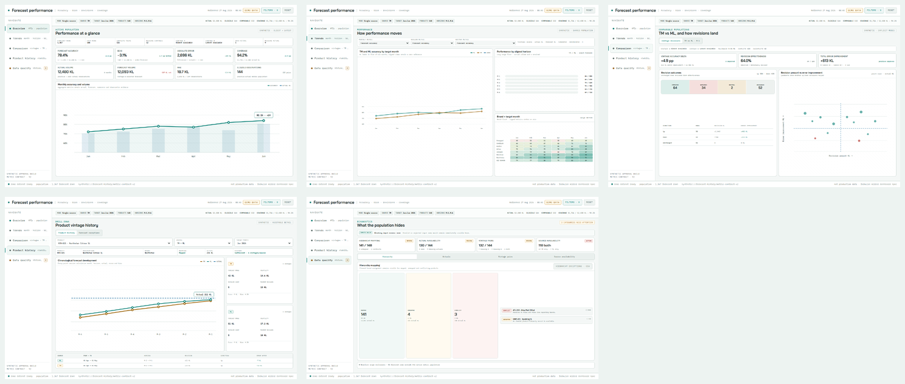
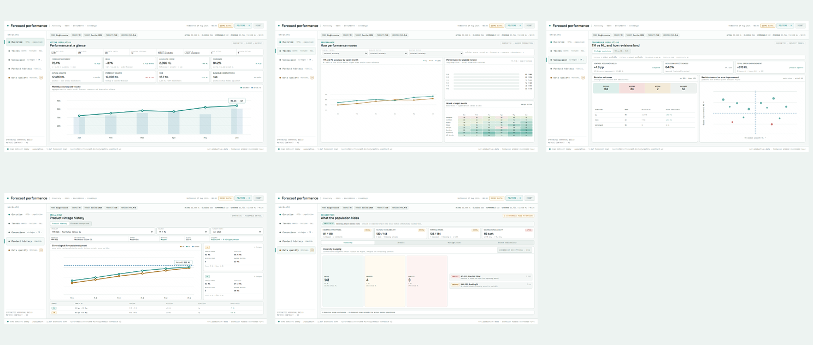
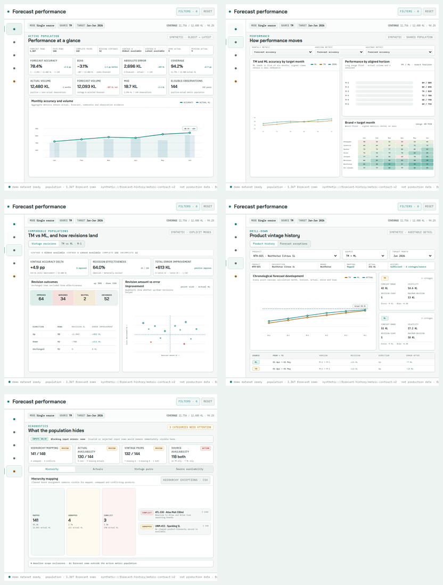
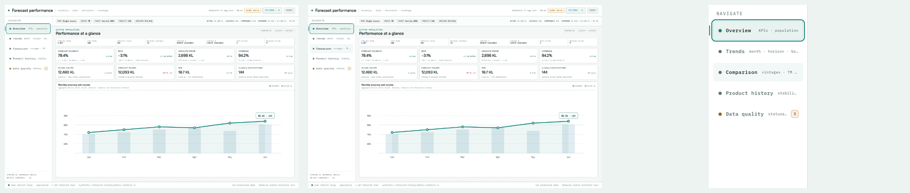

# Static dashboard UI validation

Generated: 2026-08-27T19:36:18.206Z

## Result

**PASS** — all browser, interaction, accessibility, overflow, typography, contrast, OCR, and screenshot checks passed.

## Coverage

- 5 tabs × 3 viewports = 15 primary screenshots
- Focus-visible, hover, and rail-detail states
- Click, keyboard, reset, hash-change, and browser-back navigation
- Zero page scroll, pane scroll, and horizontal overflow
- Loaded font faces and reduced-motion behavior
- WCAG text contrast ratios ≥ 4.5:1
- OCR heading verification and nonblank/distinct screenshot checks
- Console, page exception, network, and HTTP error checks

## Contact sheets

## Contrast

| Pair | Ratio |
| --- | ---: |
| text/panel | 16.02:1 |
| muted/panel3 | 5.31:1 |
| faint/panel3 | 4.99:1 |
| faint2/panel3 | 4.69:1 |
| teal/panel | 4.88:1 |
| amber/panel | 5.28:1 |

## Layout matrix

| Viewport | Tab | Page scroll | Horizontal overflow | Pane scroll | Bottom gap |
| --- | --- | ---: | ---: | ---: | ---: |
| desktop | overview | 0px | 0px | 0px | 22px |
| desktop | trends | 0px | 0px | 0px | 22px |
| desktop | comparison | 0px | 0px | 0px | 22px |
| desktop | history | 0px | 0px | 0px | 22px |
| desktop | quality | 0px | 0px | 0px | 22px |
| short | overview | 0px | 0px | 0px | 20px |
| short | trends | 0px | 0px | 0px | 20px |
| short | comparison | 0px | 0px | 0px | 20px |
| short | history | 0px | 0px | 0px | 20px |
| short | quality | 0px | 0px | 0px | 20px |
| narrow | overview | 0px | 0px | 0px | 20px |
| narrow | trends | 0px | 0px | 0px | 20px |
| narrow | comparison | 0px | 0px | 0px | 20px |
| narrow | history | 0px | 0px | 0px | 20px |
| narrow | quality | 0px | 0px | 0px | 20px |
